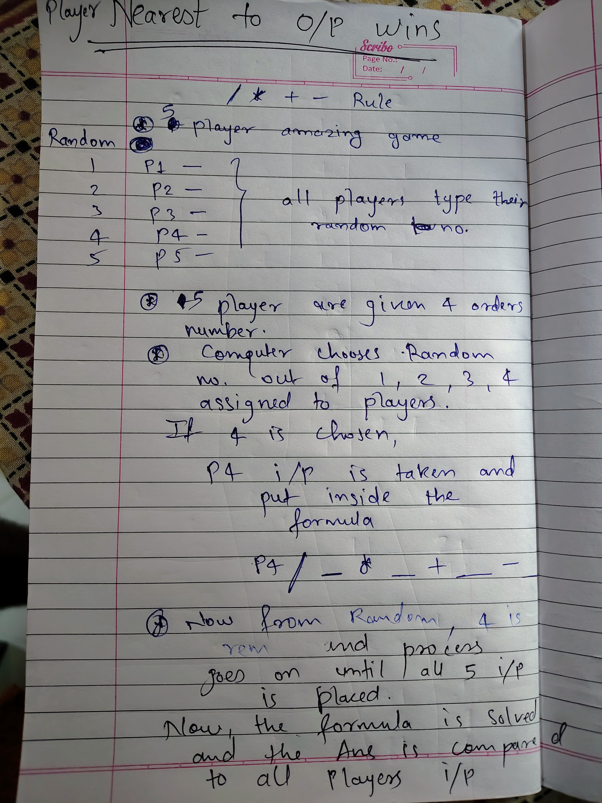

Here’s the updated `README.md` with the requested section for placing the handwritten page image:

---

# Gamble of Numbers

## Overview
This C++ project implements a game called **Gamble of Numbers**, where 5 players provide random inputs that are sequentially placed into a predefined formula. Each player is assigned a unique index between 1 and 5, and these indices are randomly selected to determine the order in which their input is placed into the formula. After solving the formula, the result is compared to each player's input, and the player with the closest match wins the game.

## Game Rules

1. **Players**: The game involves 5 players: P1, P2, P3, P4, and P5.
2. **Player Input**: Each player provides a random number as their input.
3. **Formula Structure**:
   - The formula is fixed: `_ / _ * _ + _ - _`.
   - The underscores (`_`) represent positions in the formula that will be filled with player inputs sequentially from left to right.
4. **Random Index Assignment**:
   - Each player is randomly assigned a unique index number between 1 and 5.
   - The inputs from the players are placed sequentially from left to right into the formula based on the random selection of their indices.
   - Once a player's input is placed, their index is removed from the pool of possible selections, ensuring that no player's input is used more than once.
5. **Game Objective**:
   - After the formula is solved, the result is compared to each player's input.
   - The player whose input has the smallest difference from the formula's result is declared the winner.

## Game Flow

1. **Player Input**:
   - Each player (P1, P2, P3, P4, and P5) provides a random number.
   
2. **Random Selection of Input Order**:
   - Each player is assigned an index number between 1 and 5.
   - The computer randomly selects an index, and the corresponding player's input is placed in the first position of the formula.
   - The next randomly selected player’s input is placed in the second position of the formula, and so on.
   - This process continues until all 5 players' inputs have been sequentially placed from left to right into the formula.

3. **Formula Evaluation**:
   - The formula, now filled with player inputs, is evaluated.
   - Example formula after random assignment: `P4 input / P1 input * P5 input + P2 input - P3 input`.

4. **Result Comparison**:
   - The result of the formula is compared to each player's input.
   - The absolute difference between each player's input and the result is calculated.
   - The player whose input has the smallest difference from the result wins the game.

## Example

Given the formula: `_ / _ * _ + _ - _` and players’ inputs:

- P1 = 12
- P2 = 7
- P3 = 5
- P4 = 9
- P5 = 4

Random assignment of players to the formula might result in: `P4 / P1 * P5 + P2 - P3`.

This gives: `9 / 12 * 4 + 7 - 5`.

The formula is then evaluated, and the closest player input to the result wins the game.

## Concept Image

Below is the image illustrating the concept of the **Gamble of Numbers** game:

## Features

- **Fixed Formula**: The mathematical formula is always `_ / _ * _ + _ - _`.
- **Sequential Input Assignment**: Players' inputs are placed sequentially from left to right in the formula.
- **Competitive Objective**: The goal is for players to have the smallest difference between their input and the formula's output.

## Future Enhancements

- Add more complex formulas or allow user-defined formulas.
- Increase the number of players or allow dynamic player count.
- Add a graphical user interface (GUI) for better user interaction.

HAPPY CODING!!