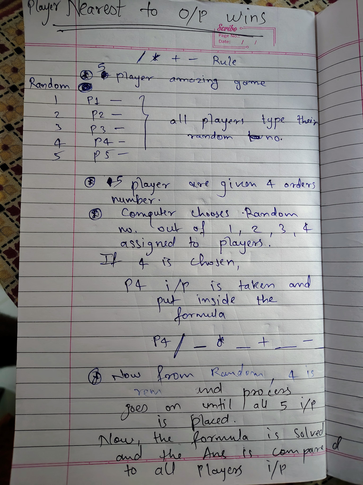

# Gamble of Numbers

A browser-based number game built with **React + Vite** where 5 players bet on their inputs against a randomly shuffled formula.

## Concept

[](./Game-Concept.jpg)

---

## How It Works

1. Each of the 5 players enters a number
2. The computer randomly shuffles the players into the fixed formula:
   ```
   _ ÷ _ × _ + _ − _
   ```
3. The formula is evaluated
4. The player whose input is **closest to the result** wins

## Project Structure

```
Gamble-Of-Numbers/
├── src/
│   ├── App.jsx
│   ├── main.jsx
│   └── components/
│       └── GambleOfNumbers.jsx
├── index.html
├── package.json
├── vite.config.js
├── .gitignore
├── Game-Concept.jpg
└── README.md
```

## Getting Started

```bash
# Clone the repo
git clone https://github.com/rnrahate/Gamble-Of-Numbers.git
cd Gamble-Of-Numbers

# Install dependencies
npm install

# Run locally
npm run dev
```

## Tech Stack

| Tool | Purpose |
|------|---------|
| React | UI framework |
| Vite | Dev server & bundler |

## Features

- Random formula assignment each round
- Animated formula reveal with player color coding
- Live leaderboard ranked by closeness to result
- Division-by-zero protection
- Fully responsive — works on mobile

## Future Enhancements

- Multiplayer via WebSockets
- Custom formula builder
- Score tracking across rounds
- Sound effects on reveal

---

HAPPY CODING!!